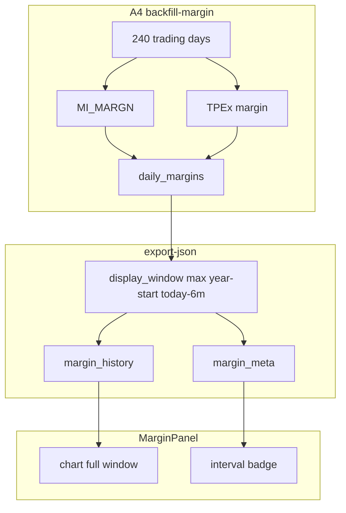
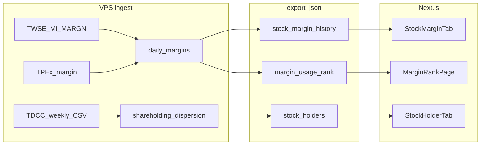

# 資券／大戶散戶／使用率排行

> 狀態：**Phase A0–A3 已實作（2026-08-25）**；Phase B/C 待確認。每次只開一個 Phase。
> 對齊：`docs/20`（不進綜合分、不新增第 14 策略）、`docs/03`（官方免費優先）、`docs/25`（個股 tab IA）

## 1. 背景

使用者需求三項，寫入同一份規劃、分 Phase 實作：

| # | 功能 | 摘要 |
|---|---|---|
| 1 | **大戶／散戶** | 集保戶股權分散（週更）；門檻 400/600/800/1000 張；**張數比例｜持股人數** 雙模式 |
| 2 | **個股資券** | 擴充既有 `daily_margins`；含**融資成本（估算）**；個股新 tab「資券」 |
| 3 | **融資使用率排行** | 新頁 `/margin`；`balance/limit` 由高到低 |

**非目標**

- 不進綜合分、不新增 S14、不改既有 `I_MARGIN_OK` / `R_MARGIN_HOT` 門檻語意
- 不引入 GoodInfo HTML scraper、付費 API、R2
- 不做 TDCC 多年全歷史回補（顯示窗見 §3.2）

---

## 2. 現況差距

| 需求 | 現況 | 缺口 |
|---|---|---|
| 融資／融券餘額、前日、限額 | `daily_margins` 已有；來源 TWSE `MI_MARGN`／TPEx | 買進／賣出／現償 **importer 未存** |
| 融資使用率 | `scores.py` 已算 `margin_balance/margin_limit` | **未 export** 至個股 JSON／無排行頁 |
| 融資成本 | 無 | 官方無欄；需 **買進＋收盤價遞推估算** |
| 大戶／散戶 | 無 | 與分點「前 15 大」**不同源**；需 TDCC |
| 當沖、借券賣 | 無 | Phase C |

個股頁現有一級 tab：`chart | chips | insti | tech | warrant`（`web/app/stock/page.tsx`）。**無資券、無大戶 tab**。

`MI_MARGN` 欄位對照（`pipeline/radar/providers/twse.py` 已 positional parse，僅存餘額）：

```
0 代號  1 名稱
融資: 2 買進  3 賣出  4 現金償還  5 前日餘額  6 今日餘額  7 限額
融券: 8 買進  9 賣出  10 現券償還  11 前日餘額  12 今日餘額  13 限額
14 資券互抵  15 註記
```

---

## 3. 資料來源盤點

### 3.1 現有管線 vs GoodInfo

| 需求 | 專案現況 | 官方／免費主源 | GoodInfo |
|---|---|---|---|
| 大戶／散戶 | 未接 | **TDCC 集保戶股權分散表** | 再呈現 TDCC；無 API；HTML 爬有 ToS／防爬風險 |
| 融資買進／餘額／使用率 | 已抓 `MI_MARGN`，買進丟棄 | TWSE／TPEx（已接） | 與官報同源，可略過 |
| 融資成本 | 無 | **任何官方管道皆無此欄** | 資券頁亦無官方成本；有數字也是估算 |

**定案**

1. **大戶**：主源 TDCC；GoodInfo 僅人工對照。  
2. **融資成本**：不爬第三方；擴 `MI_MARGN` 買進＋`daily_prices.close` 遞推。  
3. **暫不納入 GoodInfo scraper**（零成本、官方優先）。若日後需對齊他站 UI，另開工作包。

### 3.2 TDCC（大戶）

| 項目 | 值 |
|---|---|
| 資料集 | [data.gov.tw 11452](https://data.gov.tw/dataset/11452) |
| 下載 | `https://opendata.tdcc.com.tw/getOD.ashx?id=1-5`（全市場 CSV） |
| 頻率 | 每週最後一個營業日 |
| 欄位 | 資料日期、證券代號、持股分級、人數、股數、占集保庫存數比例％ |
| 分級 | 15 級距 + 合計（詳 §4.1） |

**顯示歷史窗（定案）**

```
display_from = min(當年-01-01, today − 6 個月)
display_to   = 最新一週 as_of
```

- 例：2026-08 看 → 2026-01-01～至今（當年度）  
- 例：2027-01 看 → 約 2026-07～2027-01（跨年初期自動帶前 6 個月）  
- V1 不做多年回補；DB 可多留緩衝，**UI／export 只出上述窗**

### 3.3 資券（TWSE／TPEx）

| 項目 | 上市 | 上櫃 |
|---|---|---|
| 端點 | TWSE `MI_MARGN` | TPEx `margin/balance` |
| 排程 | 已有 `vps/scripts/daily-margin.sh` @ 22:10 | 同左 |
| FinMind | `TaiwanStockMarginPurchaseShortSale` 可備援；**亦無融資成本欄** | |

---

## 4. 功能 1 — 大戶／散戶

### 4.1 TDCC 級距 → 門檻對照（張 = 股 ÷ 1000）

| TDCC 分級 | 股數區間 | 累加規則 |
|---|---|---|
| 1 | 1–999 | 散戶用（V1 次要） |
| 2 | 1,000–5,000 | |
| … | … | |
| 11 | 200,001–400,000 | |
| 12 | 400,001–600,000 | **≥400 張** 起算 |
| 13 | 600,001–800,000 | **≥600 張** 起算 |
| 14 | 800,001–1,000,000 | **≥800 張** 起算 |
| 15 | 1,000,001+ | **≥1000 張** 起算（持正好 1000 張在 tier 14 上限；實作後以 2330 等抽樣與集保官網對齊邊界） |

**大戶門檻（定案）**：400｜600｜800｜1000 張 — 對應累加 tier 12～15、13～15、14～15、15。

### 4.2 Schema

```sql
-- 週快照明細（可選物化 summary 加速 export）
shareholding_dispersion (
  stock_id   TEXT,
  as_of      TEXT,      -- YYYYMMDD 週結算日
  tier       INTEGER,   -- 1–15
  holders    INTEGER,
  shares     INTEGER,
  pct        REAL,       -- 占集保庫存％
  PRIMARY KEY (stock_id, as_of, tier)
)
```

Export 每週每檔預聚合（N ∈ {400,600,800,1000}）：

```json
{
  "as_of": "20260815",
  "thresholds": {
    "400": { "holders": 123, "shares_pct": 45.2 },
    "600": { "holders": 89, "shares_pct": 38.1 },
    "800": { "holders": 56, "shares_pct": 31.0 },
    "1000": { "holders": 12, "shares_pct": 18.4 }
  }
}
```

### 4.3 UI（個股 tab「大戶」）

1. **門檻 pills**：400｜600｜800｜1000  
2. **檢視**：`張數比例`｜`持股人數`  
   - 比例：該門檻以上持股占集保庫存％  
   - 人數：該門檻以上持有人數加總  
3. **圖**：依模式畫序列 + 可選股價灰線  
4. **表**：週 as_of、比例或人數（隨模式）  
5. **文案**：「週資料、級距為集保分級彙總，≠分點主力」

### 4.4 排程

- 新 provider：`pipeline/radar/providers/tdcc_shareholding.py`  
- 週六或週日輕量 job（避開平日 daily 窗、mid-publish）  
- 寫入 `vps/scripts/crontab.example`；**VPS 掛載需使用者確認**

---

## 5. 功能 2 — 個股資券

### 5.1 Schema 擴充（Phase A0）

`daily_margins` 新增（命名可微调，語意固定）：

| 欄位 | 說明 |
|---|---|
| `margin_buy` | 融資買進（張） |
| `margin_sell` | 融資賣出 |
| `margin_repay` | 融資現金償還 |
| `short_buy` / `short_sell` / `short_repay` | 融券對應（Phase C 前可先存） |
| `margin_cost` | 可選：遞推結果落庫；或僅 export 時計算 |

### 5.2 融資成本估算（Phase A1）

**查證**：TWSE／FinMind／GoodInfo 資券頁皆**無**官方「融資成本／均價」。籌碼 App 同類欄位為**軟體估算**。

**V1 公式**（UI 固定標「估算，非官方／非個人真實成本」）：

```
buy_t   = 當日融資買進（張）
close_t = 當日收盤價
bal_t   = 融資今日餘額（張）

若 bal_t == 0 → cost_t = null（重置）

否則：
  cost_t = (cost_{t-1} * max(bal_t - buy_t, 0) + close_t * buy_t) / bal_t

首日無 cost_{t-1}：buy_t > 0 時以 close_t 初始化，否則 null
```

- 賣出／現償：視為以「昨日成本」減少部位，不另估賣價  
- 模組：`pipeline/radar/compute/margin_cost.py` + pytest  
- 誤差來源：除權息、調整量、資料缺口、TPEx 欄位不全

### 5.3 Export

個股 JSON 新增 `margin_history`（**Phase A4 前**：近 240 交易日硬上限；**A4 後**：對齊 §5.5 顯示窗，見下）：

```json
{
  "t": "2026-08-22",
  "balance": 4405,
  "prev": 4325,
  "limit": 20000,
  "usage": 0.223,
  "chg": 80,
  "buy": 106,
  "cost_est": 985.5,
  "short_balance": 29
}
```

另附 `margin_meta`（A4）：

```json
{
  "display_from": "2026-01-01",
  "display_to": "2026-08-24",
  "db_earliest": "2025-08-26",
  "backfill_target_days": 240
}
```

### 5.4 UI（個股 tab「資券」）

- 子切換：融資｜融券｜（當沖／借券 — Phase C，可先殼或標「尚未接入」）  
- 圖：增減柱 + 餘額線 + 股價；可選疊融資成本線  
- 表：日期、餘額、增減、使用率％、融資成本（估算）  
- freshness：`radar.freshness.margin`

### 5.5 資券歷史回補 + 顯示窗（Phase A4，對齊大戶 §3.2）

> **使用者定案（2026-08-25）**：DB 回補 **約 1 個日曆年（240 交易日）** 全市場資券；**UI／export 顯示窗** 與規劃中的大戶 tab 相同公式。

#### 5.5.1 現況差距

| 項目 | 現況 | 缺口 |
|---|---|---|
| DB 深度 | 每晚 `import-daily margin` 增量；A0 前舊列可能缺 `margin_buy` 等 | 需 **240 交易日** 全市場回補＋舊列補欄 |
| export | `_margin_history_payload` 查 400 曆日、截 240 列 | 未用「當年／跨年前 6 月」窗 |
| UI | `MarginPanel` 圖固定近 **60 日** | 未標示顯示區間；未對齊大戶 UX |

#### 5.5.2 顯示窗公式（與大戶 §3.2 共用）

```python
# pipeline/radar/compute/display_window.py（A4 抽共用；B1 大戶 export 復用）
display_from = min(當年-01-01, today − 6 個月)
display_to   = 該檔最新一筆 margin 日期（≤ radar.data_date 的 margin as_of）
```

| 情境 | 例（today） | 顯示區間 |
|---|---|---|
| 當年度內 | 2026-08-25 | **2026-01-01**～最新資券日（約 8 個月） |
| 跨年初期 | 2027-01-15 | **2026-07-15**～2027-01-15（自動帶前 6 月） |
| 2027-08 | 2027-08-20 | **2027-01-01**～最新（又回到「只看當年」） |

- **日頻**（資券）vs **週頻**（TDCC 大戶）：公式相同，粒度不同。  
- DB 可保留 **240 交易日** 緩衝；**export／UI 只出 display_from～display_to 內列**。  
- 個股若窗內資料不足（新上市／長期停牌）：誠實標「窗內僅 N 日」。

#### 5.5.3 回補範圍（DB）

| 項目 | 定案 |
|---|---|
| 深度 | **240 交易日**（≈ 1 曆年；與 `backfill --days 240` 同量級） |
| 範圍 | **全市場** 上市＋上櫃 `type=stock`（ETF 可選：與現行 importer 一致一併 upsert） |
| 來源 | TWSE `MI_MARGN`（1 req/日）+ TPEx `margin/balance`（1 req/日）— **勿** FinMind 逐檔 |
| 欄位 | A0 全欄：餘額／前日／限額／買賣／現償（融資＋融券） |
| 估計請求 | 240 日 × 2 源 ≈ **480 HTTP**；禮貌 sleep 0.3–0.5s/日 → **約 5–15 分鐘** |
| 估計列數 | ~2,500 檔 × 240 日 ≈ **60 萬列** upsert（`daily_margins` 已存在則更新買進欄） |

**與現有 `backfill` 差異**：現行 `backfill()` 以 `daily_prices` 有無該日決定是否跳過，**無法**只補「有報價但缺 margin／缺 buy 欄」的日期。A4 新增 **`backfill-margin`**（或 `backfill --datasets margin --only-gaps`）：

1. 由 `daily_prices` 或交易日曆 walk 出最近 240 個交易日  
2. 若該日 `daily_margins` 列數 < 門檻（如 <500）或 `margin_buy IS NULL` 占比過高 → 跑 `import-daily --datasets margin`  
3. 寫 `import_logs`；可 `--dry-run` 列缺口日數  

**CLI（提案）**：

```bash
# VPS 一次性（需使用者確認；回補中避開與 branch/warrant bf 搶 DB 寫可選 pause）
python -m radar backfill-margin --days 240 --sleep 0.4

# 驗收
python -m radar backfill-margin --days 240 --dry-run
sqlite3 data/radar.db "SELECT date, COUNT(*), SUM(margin_buy IS NULL) FROM daily_margins GROUP BY date ORDER BY date DESC LIMIT 5;"
```

#### 5.5.4 Export 調整（A4）

| 項目 | 定案 |
|---|---|
| 查詢 | `WHERE date >= display_from AND date <= display_to`（per-stock `display_to` = 該檔 max date） |
| 上限 | 窗內全列（通常 ≤ ~180 交易日）；**不再**硬截 240 |
| 成本 | 仍 export 時 `build_margin_cost_series`；回補後 `margin_buy` 填滿 → 窗內成本線可畫 |
| meta | 每檔 `margin_meta.display_from/to/db_earliest` |
| radar.json | 可選全域 `margin_backfill_days: 240` 供 UI 說明 |

#### 5.5.5 UI 調整（對齊大戶 tab 節奏）

參考 §4.3 大戶 tab，資券 tab **A4 後**：

1. **區間標籤**（圖表上方，muted）：`顯示 2026/01/01–2026/08/24（當年度）` 或 `顯示近 6 個月（跨年度）`  
2. **子切換**（已有）：融資｜融券  
3. **檢視**（新增，可選 A4.1）：`餘額`｜`使用率` — 圖主線切換（類大戶「張數比例｜持股人數」）  
4. **圖**：預設畫 **整個 display 窗**（移除 `CHART_DAYS=60` 硬編）；手機高度維持 ~200px，X 軸自動稀釋標籤  
5. **表**：窗內全列；預設展開近 20 日，「顯示窗內全部 N 日」  
6. **缺口**：窗內無資料 → 教育性空狀態＋「資料自 YYYY-MM 回補中」  

**不做的**：不做多年 export；不做使用者自訂起迄（窗公式固定）。

#### 5.5.6 VPS 執行與風險

| 項目 | 建議 |
|---|---|
| 時機 | 週末或 branch/warrant bf **pause 窗**；或獨跑（480 req 輕量，通常不必 pause） |
| 完成後 | `export-json` + `deploy_data`（可 mid-publish 若 bf 進行中） |
| 與 nightly | 回補為一次性；之後仍靠 `daily-margin` / `daily-branches` 增量 |
| 風險 | TWSE 節假日 `NoDataError` 安全跳過；TPEx 欄位缺 buy 時成本線仍可能 null |
| 高� risk | **須使用者確認**才在 VPS 跑；Executor 不自行 destructive |



---

## 6. 功能 3 — 融資使用率排行

| 項目 | 定案 |
|---|---|
| 路由 | `web/app/margin/page.tsx`（薄殼）+ 共用 `web/components/MarginUsageRank.tsx` |
| Export | `/data/rankings/margin_usage.json` |
| 列 | `{ id, name, usage, balance, limit, chg, usage_chg, close }` |
| 排序 | `usage = balance/limit`，limit>0、type=stock，**高→低**，上限 40–80 |
| 較前日 | `usage_chg` = 今日使用率 − 前日使用率（百分點）；前日限額 join 前一日 `daily_margins` |
| 導覽 | **首頁 pill「資券」**（`/?tab=margin`，手機可達）；桌機 `DesktopNav` 同連；`/margin` 保留深連 |
| 提示 | usage≥60% 對齊 `R_MARGIN_HOT`；頁內定義：餘額÷限額、限額＝交易所公布可融資上限張數（各股不同）；**不進綜合分** |
| 收盤對齊 | export 以資券 `as_of` LEFT JOIN 日 K；缺 quotes 日不剔除高使用率列（2026-08-25 修） |

---

## 7. 架構



---

## 8. Phase 與驗收

| Phase | 內容 | 驗收 |
|---|---|---|
| **A0** | 擴 `daily_margins` + importer 接全欄 | DB 有買進張；抽樣與 TWSE 官網一致 |
| **A1** | `compute_margin_cost` + export `margin_history` + `margin_usage` 榜 | pytest 過；成本線可畫；UI 標「估算」 |
| **A2** | 個股「資券」tab | 餘額／增減／使用率／融資成本 |
| **A3** | `/margin` 排行 + 導覽 | 使用率高→低；可點進個股資券 |
| **A4** | **資券 240 日回補** + **display 窗** + UI 對齊大戶 | DB 240 交易日全市場；export/UI = max(元旦, today−6月)；圖表畫滿窗 |
| **B1** | TDCC provider + 表 + 週 cron；export 窗 = max(當年元旦, today−6月) | 2027-01 可見約 6 個月；2026-08 僅當年度 |
| **B2** | 個股大戶 UI：400/600/800/1000 + 張數比例｜持股人數 | 切 1000 張時比例與人數語意一致 |
| **C** | 當沖、借券賣 | 獨立資料源與驗收 |

**實作順序**：A0→A1→A2→A3 → **A4** → B1→B2。**每次只開一個 Phase**。

---

## 9. Confirmed Scope

- [x] **Phase A0** — `daily_margins` 全欄 + importer（2026-08-25）
- [x] **Phase A1** — 融資成本估算 + export 榜單（2026-08-25）
- [x] **Phase A2** — 個股資券 tab（2026-08-25）
- [x] **Phase A3** — 使用率排行頁（2026-08-25）
- [x] **A3 UI 跟進** — 首頁資券 tab／定義文／去重複 summary_text／漏檔修復（2026-08-25）
- [x] **Phase A4** — 程式：`backfill-margin`、`display_window`、export `margin_meta`、MarginPanel（2026-08-25）
- [ ] **Phase A4 VPS** — `backfill-margin.sh` 排程執行中（週日 02:30 + 首跑 23:15）
- [ ] **Phase B** — TDCC 大戶（**使用者 2026-08-26 要求納入排程**；週更、全股票；待開實作）
- [ ] **Phase B1** — TDCC 週更入庫
- [ ] **Phase B2** — 大戶 UI（門檻 + 雙模式 + 顯示窗）
- [ ] **Phase C** — 當沖／借券（後續另確認）
- [x] **每日分點全股票** — `import-branch-trades --top 0`（不含 ETF；2026-08-26）

---

## 10. 風險與實作前注意

| 風險 | 緩解 |
|---|---|
| TDCC 全市場 CSV 體積 + 週 cron | 週末跑、與 mid-publish 錯開；先估磁碟 |
| DB migration | 高風險；Executor 只提案，**不自跑 destructive 回補** |
| 融資成本誤差 | UI 誠實標示；不進分數、不當「主力成本」敘事 |
| 1000 張邊界 | tier 14/15 邊界；實作後抽樣對照 TDCC 官網 |
| cron | 只改 `vps/scripts/crontab.example`；**不改 `.github/workflows`** |
| 綜合分 | 本功能純觀察；對齊 `docs/20` |

---

## 12. 每日資料覆蓋（2026-08-26 使用者定案）

| 資料 | 排程 | 範圍 | 備註 |
|---|---|---|---|
| 日 K | `daily-market` 14:10 | TWSE/TPEx **全市場單請求**（含 ETF） | 當日**無成交**個股官方報表本身無列 → DB／JSON 不會有該日 K |
| 三大法人 | `daily-insti` 16:10 + branches 補抓 | 全市場單請求 | 已是全股票+ETF；非評分池 |
| 融資融券 | `daily-margin` 22:10 + branches 補抓 | 全市場單請求 | 同上；A4 已回補 240 日 |
| 分點 | `daily-branches` 17:40／21:00 | **`--top 0` = 當日有報價全部 type=stock（不含 ETF）** | 2026-08-26 起；約 1,400–2,000 檔×~1s ≈ 30–40 分／輪 |
| **大戶比率** | 週更（TDCC） | 全股票 | **尚未實作**（`docs/34` Phase B）；來源為集保週結算 CSV，**無法日更** |

**倉和卡在 8/24 根因（已釐清）**：DB 後來已有 8/25 收盤，但個股 JSON 在價格進庫後沒有再跑一次全市場 `export-json`。WP-M1 已改「不綁評分池」；之後每晚 branches／margin／stats 輪都會重匯。

---

## 11. 相關檔案（實作時）

| 區塊 | 路徑 |
|---|---|
| Schema | `pipeline/radar/schema.py` |
| TWSE margin | `pipeline/radar/providers/twse.py` |
| Import | `pipeline/radar/importer.py` |
| **A4 回補** | `pipeline/radar/importer.py`（`backfill_margin`）、`pipeline/radar/cli.py` |
| **A4 顯示窗** | `pipeline/radar/compute/display_window.py`（新建，B1 復用） |
| 評分（使用率已有） | `pipeline/radar/compute/scores.py` |
| Export | `pipeline/radar/export/json_export.py` |
| 個股頁 | `web/app/stock/page.tsx` |
| 資券 UI | `web/components/MarginPanel.tsx` |
| 新頁 | `web/app/margin/page.tsx` |
| Cron 範例 | `vps/scripts/crontab.example` |
| 分點每日 | `vps/scripts/daily-branches.sh`（`--top 0` 全股票） |
