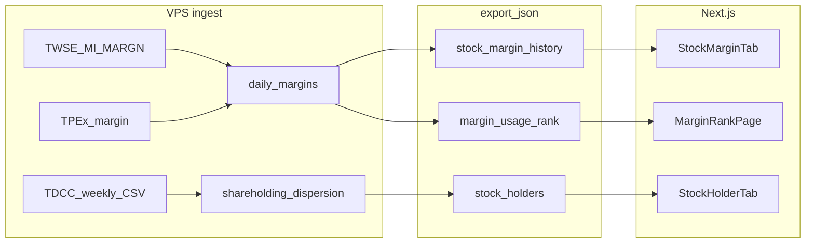

# 資券／大戶散戶／使用率排行

> 狀態：**規劃定案（2026-08-25）** — 程式未實作；每次只開一個 Phase，Executor 動手前需使用者確認  
> 對齊：`docs/20`（不進綜合分、不新增第 14 策略）、`docs/03`（官方免費優先）、`docs/25`（個股 tab IA）

## 1. 背景

使用者需求三項，寫入同一份規劃、分 Phase 實作：

| # | 功能 | 摘要 |
|---|---|---|
| 1 | **大戶／散戶** | 集保戶股權分散（週更）；門檻 400/600/800/1000 張；**張數比例｜持股人數** 雙模式 |
| 2 | **個股資券** | 擴充既有 `daily_margins`；含**融資成本（估算）**；個股新 tab「資券」 |
| 3 | **融資使用率排行** | 新頁 `/margin`；`balance/limit` 由高到低 |

**非目標**

- 不進綜合分、不新增 S14、不改既有 `I_MARGIN_OK` / `R_MARGIN_HOT` 門檻語意
- 不引入 GoodInfo HTML scraper、付費 API、R2
- 不做 TDCC 多年全歷史回補（顯示窗見 §3.2）

---

## 2. 現況差距

| 需求 | 現況 | 缺口 |
|---|---|---|
| 融資／融券餘額、前日、限額 | `daily_margins` 已有；來源 TWSE `MI_MARGN`／TPEx | 買進／賣出／現償 **importer 未存** |
| 融資使用率 | `scores.py` 已算 `margin_balance/margin_limit` | **未 export** 至個股 JSON／無排行頁 |
| 融資成本 | 無 | 官方無欄；需 **買進＋收盤價遞推估算** |
| 大戶／散戶 | 無 | 與分點「前 15 大」**不同源**；需 TDCC |
| 當沖、借券賣 | 無 | Phase C |

個股頁現有一級 tab：`chart | chips | insti | tech | warrant`（`web/app/stock/page.tsx`）。**無資券、無大戶 tab**。

`MI_MARGN` 欄位對照（`pipeline/radar/providers/twse.py` 已 positional parse，僅存餘額）：

```
0 代號  1 名稱
融資: 2 買進  3 賣出  4 現金償還  5 前日餘額  6 今日餘額  7 限額
融券: 8 買進  9 賣出  10 現券償還  11 前日餘額  12 今日餘額  13 限額
14 資券互抵  15 註記
```

---

## 3. 資料來源盤點

### 3.1 現有管線 vs GoodInfo

| 需求 | 專案現況 | 官方／免費主源 | GoodInfo |
|---|---|---|---|
| 大戶／散戶 | 未接 | **TDCC 集保戶股權分散表** | 再呈現 TDCC；無 API；HTML 爬有 ToS／防爬風險 |
| 融資買進／餘額／使用率 | 已抓 `MI_MARGN`，買進丟棄 | TWSE／TPEx（已接） | 與官報同源，可略過 |
| 融資成本 | 無 | **任何官方管道皆無此欄** | 資券頁亦無官方成本；有數字也是估算 |

**定案**

1. **大戶**：主源 TDCC；GoodInfo 僅人工對照。  
2. **融資成本**：不爬第三方；擴 `MI_MARGN` 買進＋`daily_prices.close` 遞推。  
3. **暫不納入 GoodInfo scraper**（零成本、官方優先）。若日後需對齊他站 UI，另開工作包。

### 3.2 TDCC（大戶）

| 項目 | 值 |
|---|---|
| 資料集 | [data.gov.tw 11452](https://data.gov.tw/dataset/11452) |
| 下載 | `https://opendata.tdcc.com.tw/getOD.ashx?id=1-5`（全市場 CSV） |
| 頻率 | 每週最後一個營業日 |
| 欄位 | 資料日期、證券代號、持股分級、人數、股數、占集保庫存數比例％ |
| 分級 | 15 級距 + 合計（詳 §4.1） |

**顯示歷史窗（定案）**

```
display_from = max(當年-01-01, today − 6 個月)
display_to   = 最新一週 as_of
```

- 例：2026-08 看 → 2026-01-01～至今（當年度）  
- 例：2027-01 看 → 約 2026-07～2027-01（跨年初期自動帶前 6 個月）  
- V1 不做多年回補；DB 可多留緩衝，**UI／export 只出上述窗**

### 3.3 資券（TWSE／TPEx）

| 項目 | 上市 | 上櫃 |
|---|---|---|
| 端點 | TWSE `MI_MARGN` | TPEx `margin/balance` |
| 排程 | 已有 `vps/scripts/daily-margin.sh` @ 22:10 | 同左 |
| FinMind | `TaiwanStockMarginPurchaseShortSale` 可備援；**亦無融資成本欄** | |

---

## 4. 功能 1 — 大戶／散戶

### 4.1 TDCC 級距 → 門檻對照（張 = 股 ÷ 1000）

| TDCC 分級 | 股數區間 | 累加規則 |
|---|---|---|
| 1 | 1–999 | 散戶用（V1 次要） |
| 2 | 1,000–5,000 | |
| … | … | |
| 11 | 200,001–400,000 | |
| 12 | 400,001–600,000 | **≥400 張** 起算 |
| 13 | 600,001–800,000 | **≥600 張** 起算 |
| 14 | 800,001–1,000,000 | **≥800 張** 起算 |
| 15 | 1,000,001+ | **≥1000 張** 起算（持正好 1000 張在 tier 14 上限；實作後以 2330 等抽樣與集保官網對齊邊界） |

**大戶門檻（定案）**：400｜600｜800｜1000 張 — 對應累加 tier 12～15、13～15、14～15、15。

### 4.2 Schema

```sql
-- 週快照明細（可選物化 summary 加速 export）
shareholding_dispersion (
  stock_id   TEXT,
  as_of      TEXT,      -- YYYYMMDD 週結算日
  tier       INTEGER,   -- 1–15
  holders    INTEGER,
  shares     INTEGER,
  pct        REAL,       -- 占集保庫存％
  PRIMARY KEY (stock_id, as_of, tier)
)
```

Export 每週每檔預聚合（N ∈ {400,600,800,1000}）：

```json
{
  "as_of": "20260815",
  "thresholds": {
    "400": { "holders": 123, "shares_pct": 45.2 },
    "600": { "holders": 89, "shares_pct": 38.1 },
    "800": { "holders": 56, "shares_pct": 31.0 },
    "1000": { "holders": 12, "shares_pct": 18.4 }
  }
}
```

### 4.3 UI（個股 tab「大戶」）

1. **門檻 pills**：400｜600｜800｜1000  
2. **檢視**：`張數比例`｜`持股人數`  
   - 比例：該門檻以上持股占集保庫存％  
   - 人數：該門檻以上持有人數加總  
3. **圖**：依模式畫序列 + 可選股價灰線  
4. **表**：週 as_of、比例或人數（隨模式）  
5. **文案**：「週資料、級距為集保分級彙總，≠分點主力」

### 4.4 排程

- 新 provider：`pipeline/radar/providers/tdcc_shareholding.py`  
- 週六或週日輕量 job（避開平日 daily 窗、mid-publish）  
- 寫入 `vps/scripts/crontab.example`；**VPS 掛載需使用者確認**

---

## 5. 功能 2 — 個股資券

### 5.1 Schema 擴充（Phase A0）

`daily_margins` 新增（命名可微调，語意固定）：

| 欄位 | 說明 |
|---|---|
| `margin_buy` | 融資買進（張） |
| `margin_sell` | 融資賣出 |
| `margin_repay` | 融資現金償還 |
| `short_buy` / `short_sell` / `short_repay` | 融券對應（Phase C 前可先存） |
| `margin_cost` | 可選：遞推結果落庫；或僅 export 時計算 |

### 5.2 融資成本估算（Phase A1）

**查證**：TWSE／FinMind／GoodInfo 資券頁皆**無**官方「融資成本／均價」。籌碼 App 同類欄位為**軟體估算**。

**V1 公式**（UI 固定標「估算，非官方／非個人真實成本」）：

```
buy_t   = 當日融資買進（張）
close_t = 當日收盤價
bal_t   = 融資今日餘額（張）

若 bal_t == 0 → cost_t = null（重置）

否則：
  cost_t = (cost_{t-1} * max(bal_t - buy_t, 0) + close_t * buy_t) / bal_t

首日無 cost_{t-1}：buy_t > 0 時以 close_t 初始化，否則 null
```

- 賣出／現償：視為以「昨日成本」減少部位，不另估賣價  
- 模組：`pipeline/radar/compute/margin_cost.py` + pytest  
- 誤差來源：除權息、調整量、資料缺口、TPEx 欄位不全

### 5.3 Export

個股 JSON 新增 `margin_history`（近 **120–240 交易日**）：

```json
{
  "date": "2026-08-22",
  "balance": 4405,
  "prev": 4325,
  "limit": 20000,
  "usage": 0.223,
  "chg": 80,
  "buy": 106,
  "cost_est": 985.5,
  "short_balance": 29
}
```

### 5.4 UI（個股 tab「資券」）

- 子切換：融資｜融券｜（當沖／借券 — Phase C，可先殼或標「尚未接入」）  
- 圖：增減柱 + 餘額線 + 股價；可選疊融資成本線  
- 表：日期、餘額、增減、使用率％、融資成本（估算）  
- freshness：`radar.freshness.margin`

---

## 6. 功能 3 — 融資使用率排行

| 項目 | 定案 |
|---|---|
| 路由 | `web/app/margin/page.tsx` |
| Export | `/data/rankings/margin_usage.json` |
| 列 | `{ id, name, usage, balance, limit, chg, close, chg_pct }` |
| 排序 | `usage = balance/limit`，limit>0、type=stock，**高→低**，上限 40–80 |
| 導覽 | 桌機 `DesktopNav`；手機可自資券 tab 連排行或 BottomNav「資券榜」（避免擠爆可放次級入口） |
| 提示 | usage≥60% 對齊 `R_MARGIN_HOT` 語意；**不進綜合分** |

---

## 7. 架構



---

## 8. Phase 與驗收

| Phase | 內容 | 驗收 |
|---|---|---|
| **A0** | 擴 `daily_margins` + importer 接全欄 | DB 有買進張；抽樣與 TWSE 官網一致 |
| **A1** | `compute_margin_cost` + export `margin_history` + `margin_usage` 榜 | pytest 過；成本線可畫；UI 標「估算」 |
| **A2** | 個股「資券」tab | 餘額／增減／使用率／融資成本 |
| **A3** | `/margin` 排行 + 導覽 | 使用率高→低；可點進個股資券 |
| **B1** | TDCC provider + 表 + 週 cron；export 窗 = max(當年元旦, today−6月) | 2027-01 可見約 6 個月；2026-08 僅當年度 |
| **B2** | 個股大戶 UI：400/600/800/1000 + 張數比例｜持股人數 | 切 1000 張時比例與人數語意一致 |
| **C** | 當沖、借券賣 | 獨立資料源與驗收 |

**實作順序**：A0→A1→A2→A3 → B1→B2。**每次只開一個 Phase**。

---

## 9. Confirmed Scope

- [ ] **Phase A0** — `daily_margins` 全欄 + importer（使用者確認後 Executor）
- [ ] **Phase A1** — 融資成本估算 + export 榜單
- [ ] **Phase A2** — 個股資券 tab
- [ ] **Phase A3** — 使用率排行頁
- [ ] **Phase B1** — TDCC 週更入庫
- [ ] **Phase B2** — 大戶 UI（門檻 + 雙模式 + 顯示窗）
- [ ] **Phase C** — 當沖／借券（後續另確認）

---

## 10. 風險與實作前注意

| 風險 | 緩解 |
|---|---|
| TDCC 全市場 CSV 體積 + 週 cron | 週末跑、與 mid-publish 錯開；先估磁碟 |
| DB migration | 高風險；Executor 只提案，**不自跑 destructive 回補** |
| 融資成本誤差 | UI 誠實標示；不進分數、不當「主力成本」敘事 |
| 1000 張邊界 | tier 14/15 邊界；實作後抽樣對照 TDCC 官網 |
| cron | 只改 `vps/scripts/crontab.example`；**不改 `.github/workflows`** |
| 綜合分 | 本功能純觀察；對齊 `docs/20` |

---

## 11. 相關檔案（實作時）

| 區塊 | 路徑 |
|---|---|
| Schema | `pipeline/radar/schema.py` |
| TWSE margin | `pipeline/radar/providers/twse.py` |
| Import | `pipeline/radar/importer.py` |
| 評分（使用率已有） | `pipeline/radar/compute/scores.py` |
| Export | `pipeline/radar/export/json_export.py` |
| 個股頁 | `web/app/stock/page.tsx` |
| 新頁 | `web/app/margin/page.tsx` |
| Cron 範例 | `vps/scripts/crontab.example` |
