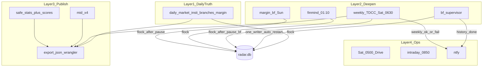
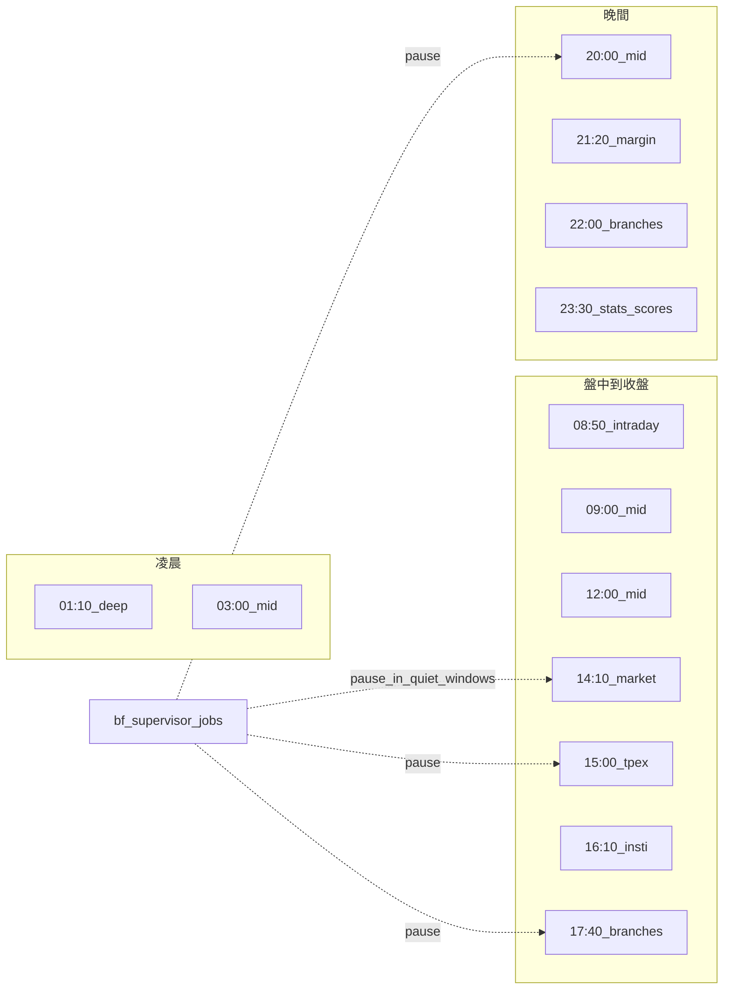

# VPS 排程／回補／大戶 — 四層架構（規劃定案）

> 狀態：**架構定案 2026-08-26，正式機最近核對 2026-08-31 16:46 +08**；`bf-supervisor`、`safe-stats＋scores`、TDCC B1/B2＋週六 06:30 與董監每月槽均已掛正式 crontab。
> 對齊：`docs/08` §0（時刻表）、`docs/33`（mid／stats）、`docs/34`（資券／大戶）、`docs/31`（單一寫者）  
> 來源：使用者確認之全盤盤點——日更與算分全留、歷史回補全自動跑到完＋ntfy、大戶納入週末槽。

## 1. 一句話

**日更真相（含算分）照跑；歷史分點／權證由管家單寫者自動跑到完；大戶週更；發布（mid／夜間 stats）與備份／盤中獨立。**

### 2026-08-31 唯讀實況與保守界線

- 本機／VPS `main` 都是 `8603f3a`；僅 `trever-vps` alias 可解析。VPS 工作樹有未追蹤 `data/`、`package-lock.json`、`radar-quick-catchup.sh`、`run-backfill.sh`，過去因此 `git pull` 失敗；**不得自行刪除、pull、重啟或修改 cron**。
- `radar-bf-branches`、`radar-worker` 均活躍，各有一個 guard/supervisor。權證歷史容器不存在，完成旗標為 `2026-08-27T00:25:33+08`。分點回補狀態為 319 日期、最後完成 `2025-05-12`、`fetched=116891`；03:56–12:26 沒有完成行，但 DB 持續成長，按長時間 in-flight 處理，**不重啟**。
- DB 約 5.32GB、WAL 約 115MB、可用空間約 7.0GB（75% 使用）、WAL mode。因仍有 writer，未跑 `integrity_check`，其結果為 unknown。最新主表日期為 2026-08-28；`branch_trades_raw=21,522,284`、`daily_prices=10,205,766`、`daily_scores=19,341`、`warrant_daily=5,729,141`。
- 已觀察到 8/28 日更成功：15:00 TPEx 10,657；21:20 margin TWSE 1,291／TPEx 920；22:48 branches 56,508。TDCC 8/29 成功（as_of 8/28，3,375 stocks／50,625 rows）；董事 8/26 成功（2026-07，1,975／45,045），下次為 9/16。
- 歷史錯誤包含 dirty `git pull`、permission denied、8/22 Drive quota 403、TPEx 520；近期未見分點錯誤。尚未驗證最新 weekly backup 是否成功且 integrity 為 ok，也未估算 completeness／ETA。可用空間低於 20GB，**不得自行啟用全市場權證輪**。
- **13:05–13:06 +08 續查（唯讀）**：分點回補仍為單實例，最後完成 `2025-05-09`、`fetched=118,264`、至少 `320/490` 日期；DB `5,324,414,976` bytes、WAL `115,298,232` bytes、可用約 7.0GB（75% 使用）。近期未見 import error；主機未見 `.db.gz`，最新成功 backup／`integrity_check` 仍無現有證據可確認。dirty tree 仍阻擋 pull；**未重啟、未改 cron、未執行正式 DB。**
- **15:00 鎖事件、520 與手動恢復**：14:10 `daily-market.sh` 因週一題材／公司資料跑至 15:11，15:00 `daily-tpex-quotes.sh` 因 DB lock 安全略過；15:43 後無 holder，勿刪空 lock path。16:10 與後續三次手動完整腳本均因 `dailyQuotes` HTTP 520 fail closed。response 為 Cloudflare SJC、16-byte body，同 URL／IP 在分鐘內交替 200／520且不是 429；只能確認 edge/origin 路徑間歇異常，無供應商內部 log 可證明更深層原因。使用者授權後，以同一官方 URL 的 curl 長退避取得並驗證 `date=20260831`、`stat=ok`、19 欄／10,713 rows，再交既有 parser＋transaction 匯入；權證彙總 845、指標 5,078、scores 750、export 2,410 stocks、Worker deploy（version `51b690a4-9b50-407d-b981-1d6c26e9533c`）均成功。正式 DB 8/31 TPEx=888 stock／119 ETF／6 ETN／1 other，正式站 6488 已顯示 2026-08-31；未改 cron／code／workflow。另清理由中止唯讀 SQL 留下的單一 orphan process，未碰 writer／回補服務。

## 2. 四層架構圖



### Layer 1 — 日更真相（已上線）

| 時間 | 腳本 | 含算分／統計 |
|---|---|---|
| 14:10 | `daily-market.sh` | indicators → **scores**；（週一）themes／geo。上櫃 quotes 此時常 empty |
| 15:00 | `daily-tpex-quotes.sh` | **上櫃日K 主補抓** → indicators → **scores** → export |
| 16:10 | `daily-insti.sh` | quotes 保底 → insti → 權證主檔（失敗不擋）→ **權證當日彙總** → indicators → **scores**；主檔成功即採新 mapping，失敗則沿用舊 mapping 完成彙總 |
| 17:40 | `daily-branches.sh` | 再補 quotes＋insti → indicators → 全股票分點 `--top 0`（不含 ETF）＋標的是 active 普通股的上市認購／認售、當日成交金額 `>=1,000,000` 元過渡池 → **branch-stats** → **scores** → **performance**（**不含 margin**）。權證 market 以 TWSE 定義，標的可為 TWSE／TPEx 普通股；此閾值取代、不疊加 legacy `--warrants` Top-N，非全市場獨立輪，未改 cron |
| 21:20 | `daily-margin.sh` | 再補 quotes + **margin 主輪** → **scores** → **performance**（TWSE ~21:00 產製＋約 20 分緩衝） |
| 22:00 | `daily-branches.sh` | 分點第二輪（排在資券後,避 lock） |

皆握 `/tmp/radar-db.lock`，結束 export＋deploy。

### Layer 2 — 加深／週更

| Job | 排程 | 行為（目標態） |
|---|---|---|
| FinMind 深歷史 | 每天 01:10 | 已深則近零 |
| 分點／權證歷史 | 長跑容器＋**bf-supervisor** | **預設自動跑到完**；掛掉自啟；**同時只一個寫者**；完成 **ntfy** |
| 資券 240 日 | 週日 02:30 | done flag 則跳過 |
| **TDCC 大戶** | **週六 06:30**（已掛） | 全市場 CSV；不進綜合分；顯示窗見 `docs/34` |

### Layer 3 — 上線發布

| Job | 排程 | 行為 |
|---|---|---|
| mid-publish | 03／09／12／20 | pause bf → 預設只 export → deploy（省 RAM，略過 stats） |
| safe-branch-stats | 23:30 | pause → stats → **目標加 scores** → export |
| 日更內 export | 隨 Layer 1 | 不變 |

### Layer 4 — 維運

| Job | 排程 |
|---|---|
| Drive 備份 | 週六 05:00（**早於** TDCC 06:30） |
| 盤中 worker | 平日 08:50–13:35 |
| ntfy | 失敗 High；日更／週更成功繁中摘要（如「三大法人 · 成功」）；回補完成／TDCC 週更 default |

## 3. 平日時間軸（示意）



## 4. 週末軸（含大戶）

```text
週六 05:00  weekly-backup
週六 06:30  weekly-tdcc（大戶，正式 cron 已掛）→ export/deploy
週日 02:30  backfill-margin（若尚未 done）
```

安靜窗須涵蓋：平日 daily／mid-flag／**週六 05:00–07:30（備份＋TDCC）**／週日 margin-bf。

## 5. 與現況差距（實作包）

| 項目 | 現況 | 目標 |
|---|---|---|
| 歷史 bf | `bf-supervisor.sh` 單寫者＋自啟；權證已完成，分點長時間 in-flight（2026-08-31：319 日期、最後完成 2025-05-12、fetched 116,891，DB 持續成長） | 先唯讀確認完成訊號／backup／integrity；不得因暫無完成行自行重啟。全市場上市＋上櫃權證新輪仍僅 code-ready，需 20GB／1日、5日與三交易日 runtime PoC 及人工確認 |
| 23:30 | `safe-branch-stats`：**stats → scores → export** | 已對齊目標 |
| 大戶 | B1 入庫＋B2 UI＋`weekly-tdcc.sh` @ 週六 06:30；正式 cron 已掛，2026-08-26 實跑成功 | 觀察下一個週六例行輪 |
| 安靜窗 | `lib.sh` 設定為 14:05–15:45；2026-08-31 唯讀稽核未重驗下一次狀態轉換，且分點回補正處於長 in-flight | 僅在下一個既有安靜窗唯讀觀察 pause／unpause；不得為驗證而重啟 guard／supervisor |

**不刪**：日更輪次、mid×4、算分、備份、盤中。大戶**不進**綜合分、**不能**日更。

## 6. 相關文件

- 時刻表細節：`docs/08` §0、`vps/scripts/crontab.example`
- mid／stats：`docs/33`
- 資券／大戶規格：`docs/34`
- VPS 單一寫者：`docs/31`
