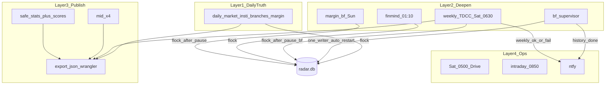
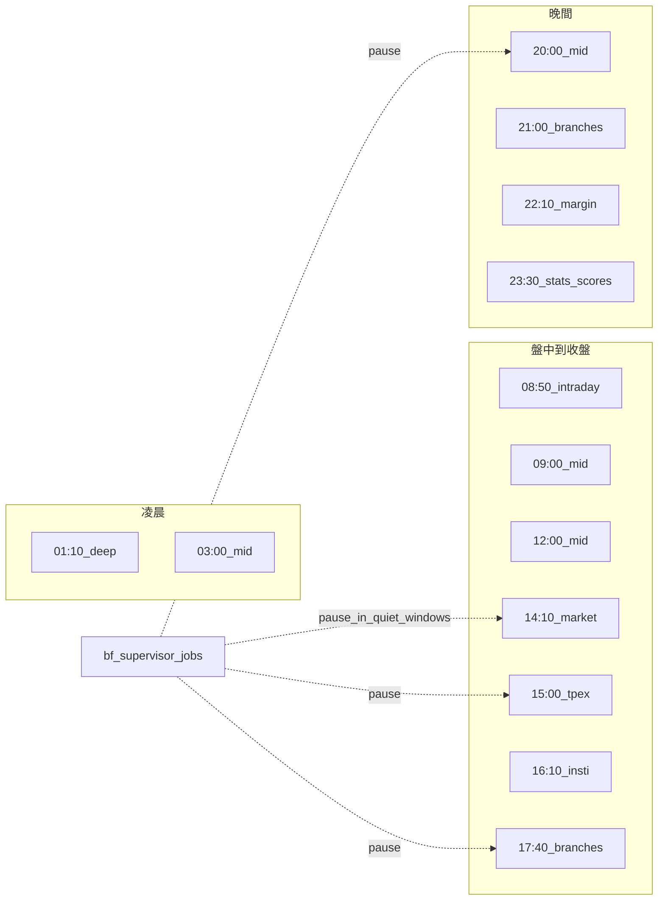

# VPS 排程／回補／大戶 — 四層架構（規劃定案）

> 狀態：**架構定案 2026-08-26**；**程式已落地**：`bf-supervisor`、`safe-stats＋scores`、TDCC B1/B2＋週六 06:30（VPS crontab 掛載仍須人工確認）  
> 對齊：`docs/08` §0（時刻表）、`docs/33`（mid／stats）、`docs/34`（資券／大戶）、`docs/31`（單一寫者）  
> 來源：使用者確認之全盤盤點——日更與算分全留、歷史回補全自動跑到完＋ntfy、大戶納入週末槽。

## 1. 一句話

**日更真相（含算分）照跑；歷史分點／權證由管家單寫者自動跑到完；大戶週更；發布（mid／夜間 stats）與備份／盤中獨立。**

## 2. 四層架構圖



### Layer 1 — 日更真相（已上線）

| 時間 | 腳本 | 含算分／統計 |
|---|---|---|
| 14:10 | `daily-market.sh` | indicators → **scores**；（週一）themes／geo。上櫃 quotes 此時常 empty |
| 15:00 | `daily-tpex-quotes.sh` | **上櫃日K 主補抓** → indicators → **scores** → export |
| 16:10 | `daily-insti.sh` | quotes 保底 → indicators → insti → **scores**（權證主檔失敗不擋） |
| 17:40／21:00 | `daily-branches.sh` | 再補 quotes＋insti → indicators → 全股票分點 `--top 0` → **branch-stats** → **scores** → **performance**（**不含 margin**） |
| 22:40 | `daily-margin.sh` | 再補 quotes + **margin 主輪** → **scores** → **performance**（TWSE ~21:00 產製） |

皆握 `/tmp/radar-db.lock`，結束 export＋deploy。

### Layer 2 — 加深／週更

| Job | 排程 | 行為（目標態） |
|---|---|---|
| FinMind 深歷史 | 每天 01:10 | 已深則近零 |
| 分點／權證歷史 | 長跑容器＋**bf-supervisor** | **預設自動跑到完**；掛掉自啟；**同時只一個寫者**；完成 **ntfy** |
| 資券 240 日 | 週日 02:30 | done flag 則跳過 |
| **TDCC 大戶** | **週六 06:30**（規劃） | 全市場 CSV；不進綜合分；顯示窗見 `docs/34` |

### Layer 3 — 上線發布

| Job | 排程 | 行為 |
|---|---|---|
| mid-publish | 03／09／12／20 | pause bf → 預設只 export → deploy（省 RAM，略過 stats） |
| safe-branch-stats | 23:30 | pause → stats → **目標加 scores** → export |
| 日更內 export | 隨 Layer 1 | 不變 |

### Layer 4 — 維運

| Job | 排程 |
|---|---|
| Drive 備份 | 週六 05:00（**早於** TDCC 06:30） |
| 盤中 worker | 平日 08:50–13:35 |
| ntfy | 失敗 High；日更／週更成功繁中摘要（如「三大法人 · 成功」）；回補完成／TDCC 週更 default |

## 3. 平日時間軸（示意）



## 4. 週末軸（含大戶）

```text
週六 05:00  weekly-backup
週六 06:30  weekly-tdcc（大戶，規劃）→ export/deploy
週日 02:30  backfill-margin（若尚未 done）
```

安靜窗須涵蓋：平日 daily／mid-flag／**週六 05:00–07:30（備份＋TDCC）**／週日 margin-bf。

## 5. 與現況差距（實作包）

| 項目 | 現況 | 目標 |
|---|---|---|
| 歷史 bf | `bf-supervisor.sh` 單寫者＋自啟＋完成 ntfy（repo 已落地） | VPS 掛 crontab／清舊雙容器後驗證 |
| 23:30 | `safe-branch-stats`：**stats → scores → export** | 已對齊目標 |
| 大戶 | B1 入庫＋B2 UI＋`weekly-tdcc.sh` @ 週六 06:30 | VPS 首次手動跑＋掛 cron |
| 安靜窗 | `lib.sh` `in_radar_quiet_window` 一處 | 已對齊 |

**不刪**：日更輪次、mid×4、算分、備份、盤中。大戶**不進**綜合分、**不能**日更。

## 6. 相關文件

- 時刻表細節：`docs/08` §0、`vps/scripts/crontab.example`
- mid／stats：`docs/33`
- 資券／大戶規格：`docs/34`
- VPS 單一寫者：`docs/31`
